# VK Kinopoisk

## Привет друг! Это выполненное профильное задание для [стажировки на роль Frontend-разработчика в VK](https://internship.vk.company/vacancy/928)

## Навигация
- [Техническое задание](#техническое-задание)
- [Демо (запустите проект без локального развертывания)](https://prod-app51951209-3317b5043fa2.pages-ac.vk-apps.com/index.html)
- [Инструкция как развернуть проект локально](#инструкция-как-развернуть-проект-локально)
- [Какие библиотеки используются](#какие-библиотеки-используются)
- [Скриншоты интерфейса и описание](#скриншоты-интерфейса-и-описание)
    - [Авторизация](#авторизация)
    - [Поиск](#поиск)
    - [Избранное](#избранное)
    - [Фильтры](#фильтры)
    - [Просмотр](#просмотр)
- [Бонус](#бонус)

### Техническое задание
> #### Цель
> Создание простого приложения для просмотра информации о фильмах с использованием React, TypeScript и открытого API (например, [Кинопоиск API](https://kinopoisk.dev/)).
> #### Функционал:
> 1. Отображение списка фильмов:
>   - Приложение должно отображать список фильмов, получаемых с помощью [API](https://kinopoisk.dev/).
>   - Отображать фильмы постранично по 50 фильмов на страницу.
>   - Для каждого фильма необходимо отобразить:
>     + Постер фильма (если доступен)
>     + Название фильма.
>     + Год выпуска.
>     + Рейтинг фильма.
> 2. Должна быть возможность фильтровать список фильмов:
>   - По жанру (выбор нескольких жанров).
>   - По рейтингу (диапазон рейтинга).
>   - По году выпуска (диапазон лет начиная с 1990).
> 3. Просмотр детальной информации о фильме:
>   - При клике на фильм из списка или результатов поиска, приложение должно переходить на страницу с детальной информацией об этом фильме.
>   - На странице фильма необходимо отобразить:
>     + Постер фильма (если доступен).
>     + Название фильма.
>     + Описание фильма.
>     + Рейтинг фильма.
>     + Дату выхода.
>     + Список жанров.
> #### Технические требования:
>   - Использовать React, TypeScript.
>   - Рекомендуется использовать хуки и функциональные компоненты React.
>   - Разрешается использовать сторонние библиотеки (Axios, MobX, React Router) и при необходимости библиотеку компонентов Material UI.
> #### Дополнительные задания:
> - Добавить возможность добавления фильмов в список "избранное".
> - Отдельная страница со списком избранных фильмов.
> - Сохранять список при перезагрузке страницы.
> #### Ожидаемый результат:
> - Рабочее многостраничное SPA приложение для просмотра информации о фильмах, удовлетворяющее всем перечисленным требованиям.
> - Код приложения, выложенный на GitHub и **ссылка на него в поле ответа**.
> - Если в приложении присутствуют переменные окружения, то **создать** файл .env.default, где будут прописаны все необходимые переменные со значениями.
> - Создать Readme.md файл с описанием запуска приложения.

### Инструкция как развернуть проект локально

#### Базовое
Чтобы использовать этот проект, установите [необходимое программное обеспечение](https://dev.vk.com/ru/mini-apps/software-installation).

Установить IDE, например [VS Code](https://code.visualstudio.com/).

#### Основное
1. Открыть консоль в папке где планируется размещать/размещаются проекты.
2. В консоль прописать команду `git clone https://github.com/dsedinkin/vk-kinopoisk.git`
3. Открыть консоль в созданной папке. Прописать команду для установки npm пакетов. Я использую команду `yarn`, можно прописать `npm install`. Ожидаем завершения установки пакетов.
4. Для запуска проекта используем команду `yarn start`. В консоли увидим локальный адрес размещения приложения.

### Какие библиотеки используются
1. [vkui](https://dev.vk.com/ru/libraries/vkui)
2. [icons](https://github.com/VKCOM/icons)
3. [vk-mini-apps-router](https://dev.vk.com/ru/libraries/router)
4. [vk-mini-apps-deploy](https://github.com/VKCOM/vk-miniapps-deploy)

### Скриншоты интерфейса и описание
## Авторизация
Для того чтоб пользоваться внешним [API](https://kinopoisk.dev/), необходимо вставить токен авторизации в поле ввода. Токен на бесплатном тарифе имеет ограничения по количеству запросов в день, это одна из причин почему я не вшил свой токен по-умолчанию.

Валидации ключа на этой странице нет! Если ошибочно или специально введены некорректные данные, то необходимо будет вернуться на страницу авторизации вручную. Это можно сделать путем изменения адреса в поисковой строке браузера.

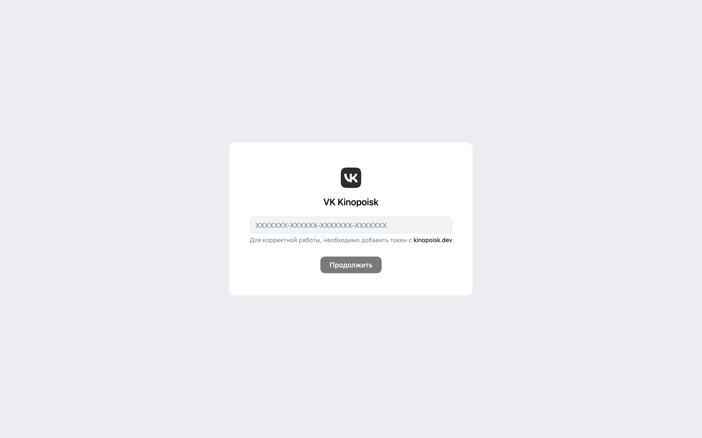

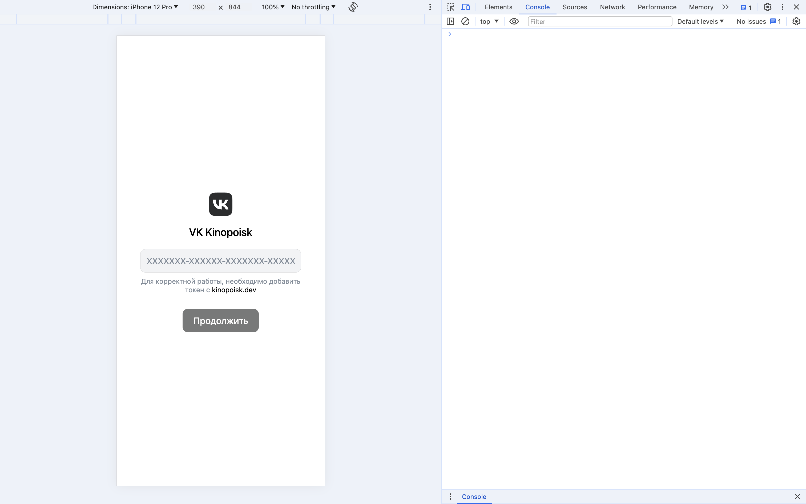

## Поиск
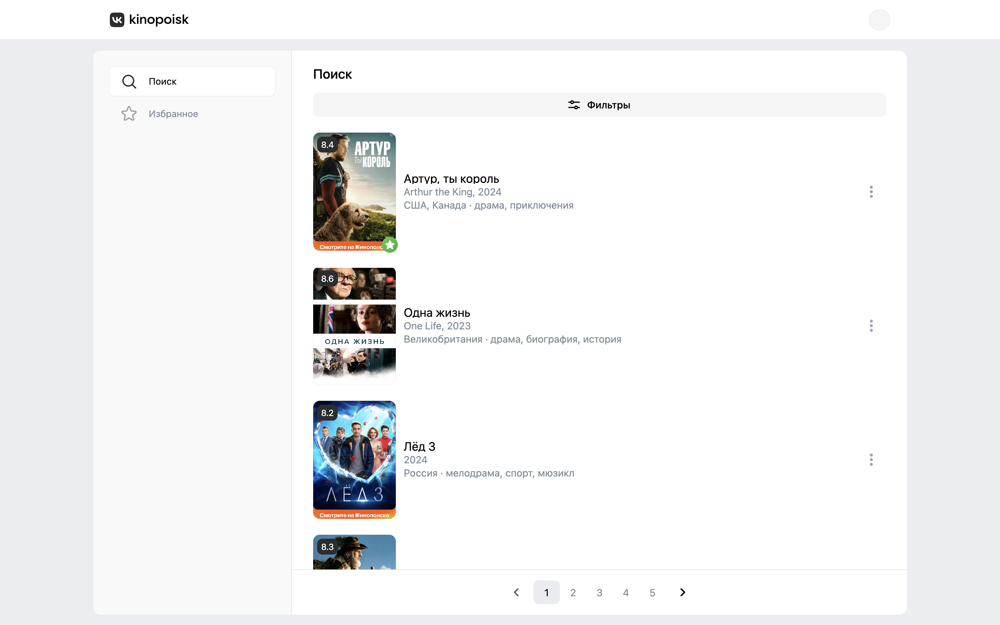
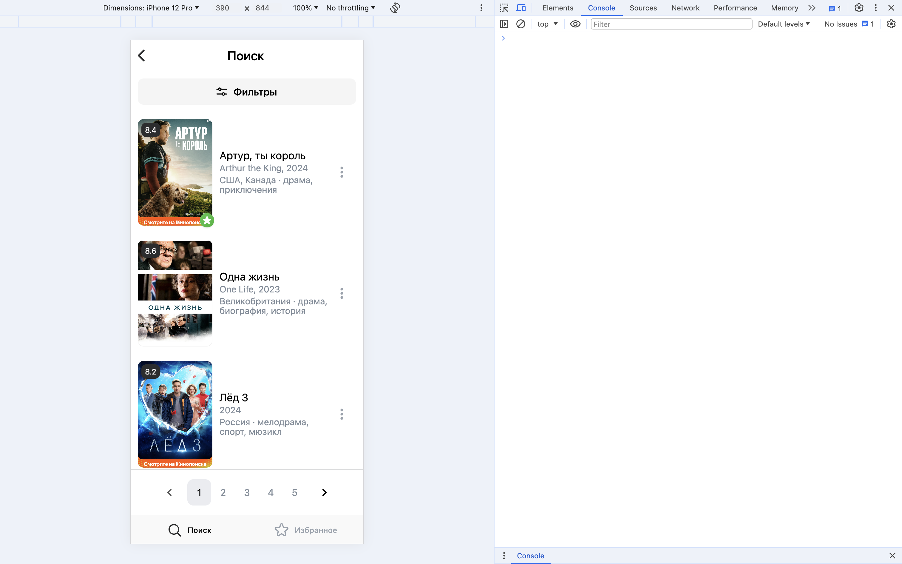
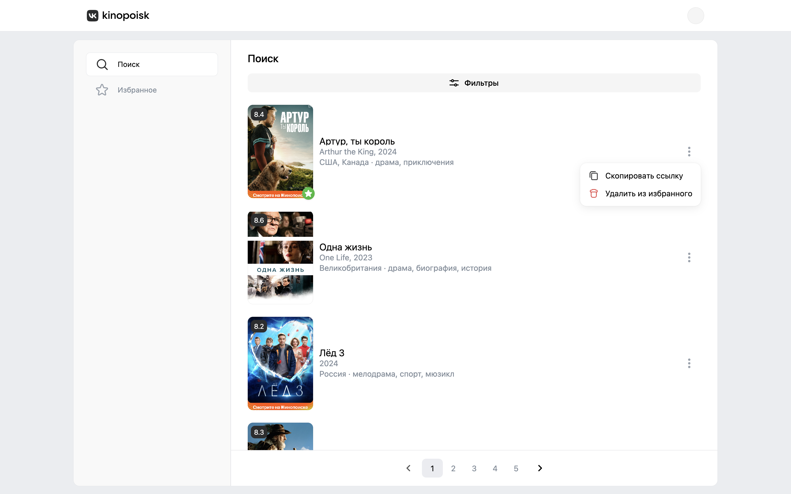
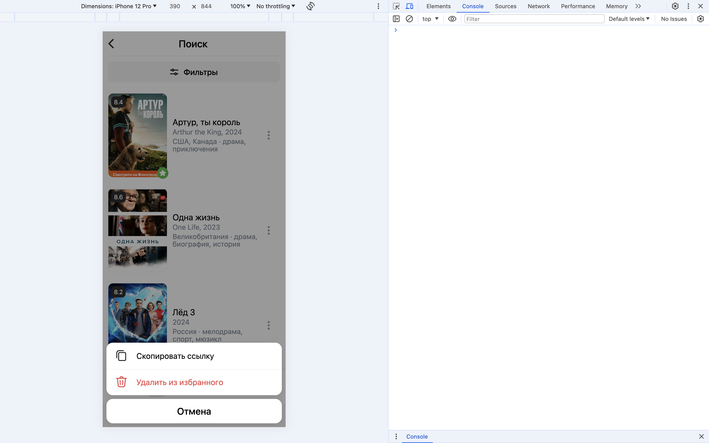
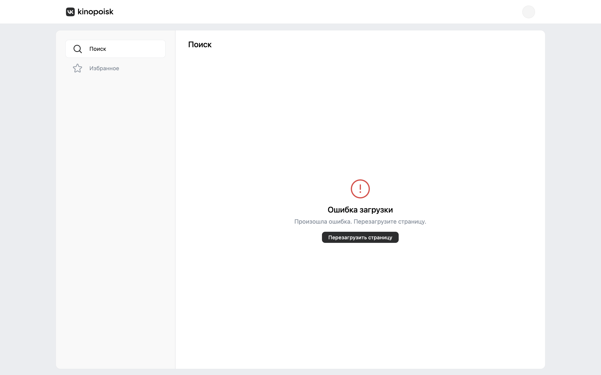
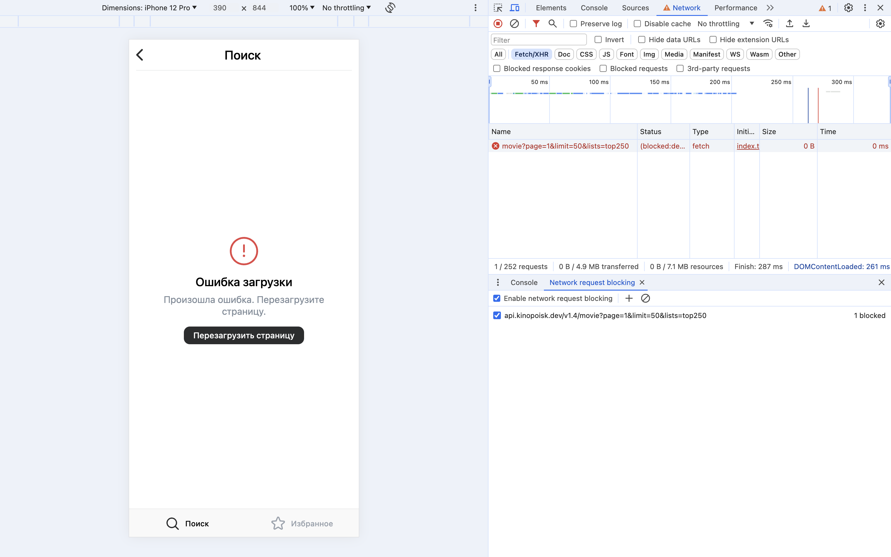

## Избранное
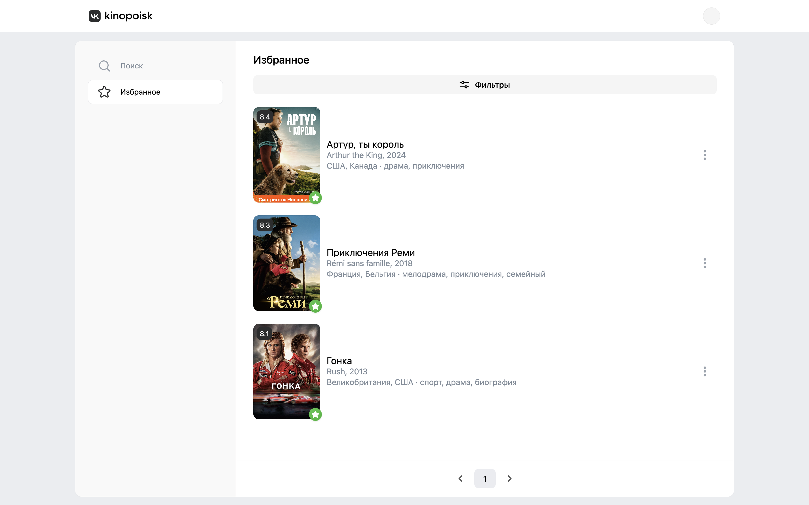
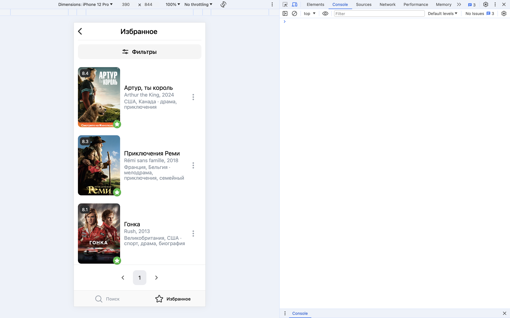

## Фильтры
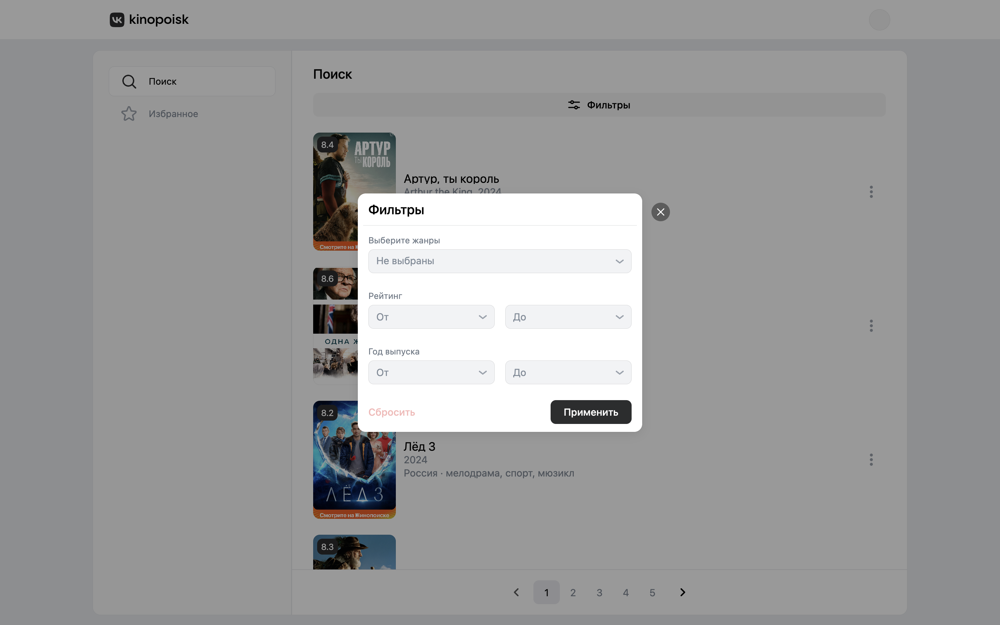
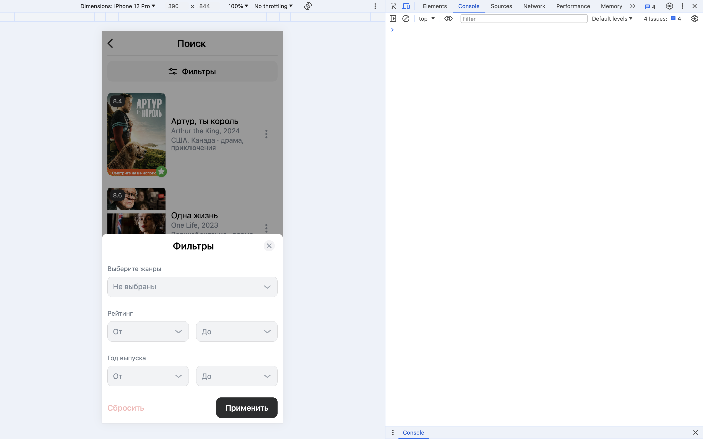

## Просмотр
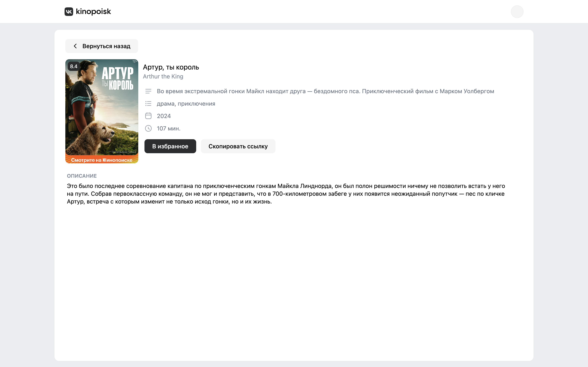
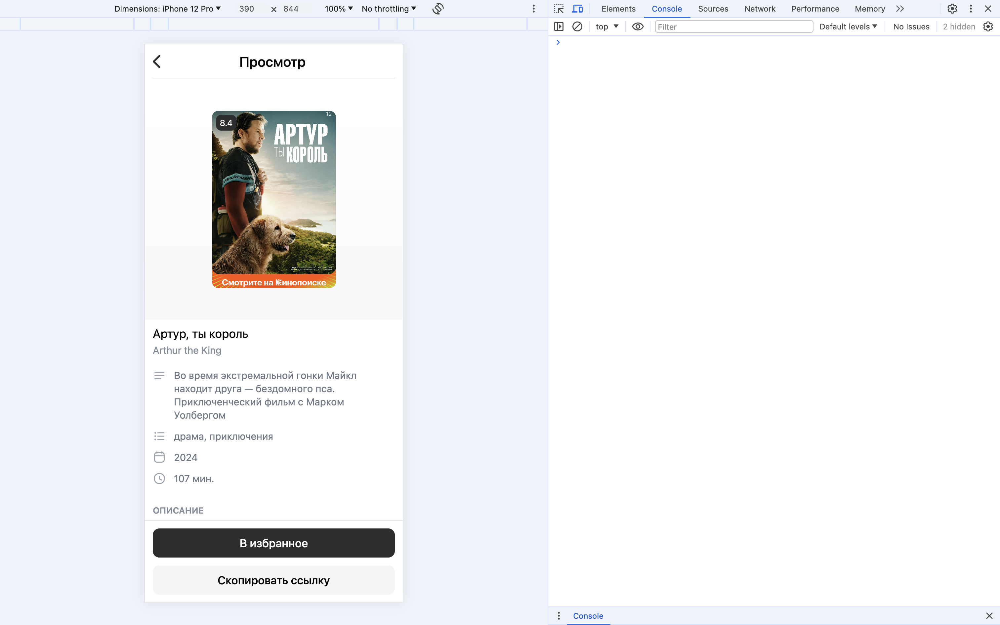

### Бонус
- По-мимо продемонстрированных есть сервисные страницы.
- Используется темная и светлая тема, в зависимости от настроек устройства.
- Практическая работа (дизайн и frontend), реализована в ограниченный срок, за четыре не полных рабочих дня, единолично.
